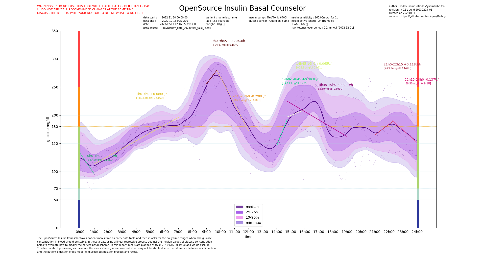
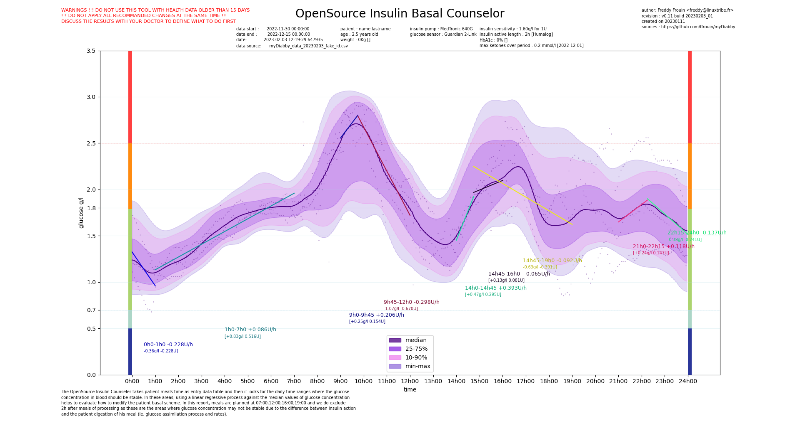
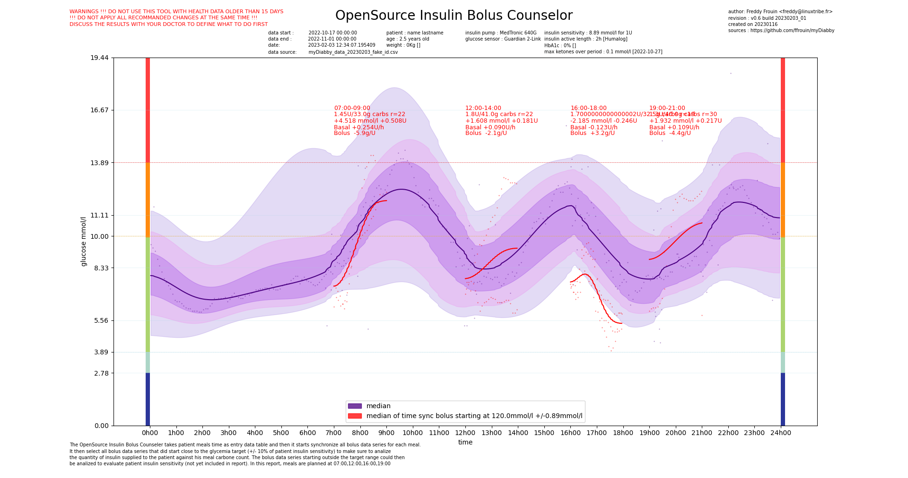

# myDiabby
OpenSource tools to try help with Diabete

The toolkit actually is based on two tools :
  - the basal counselor : for basal scheme changes
  - the bolus counselor : to adjust basal and/or bolus ratio of meals

The toolkit is able to manage unit conversion (mg/dl, g/l, mmol/l)

## DISCLAIMER AND WARNINGS

These tools have been developped by parents of a Diabete Type 1 child in order to have a better understanding of the insulin treatment
changes driven by his diabetic pediatrician.

All information, thought, and code described here is intended for informational and educational purposes only. Do not use the information
or code to make medical decisions. Share the information with your doctor if you think there is interresting data here to try take advantage of.

## ABSTRACT

Compared to adults, childrens are going to face major physiological changes during their growth. This will lead to insulin growing needs that will
be reflected by a growing average glucose concentration in blood. High glucose concentration in blood leads to well known collateral damages but
later in life. The objective is to try, as much as possible, to control or limit the hyperglycemia state over time in order to preserve patient
life expectancy.

Low blood sugar level is also a major concern as it has immediate effect on patient that could lead to loss of conciousness and to death. Insulin
treatment may be responsible for these hypoglycemia events. It is also a major objective to try prevent and limit these events in patient life.

Continous Glycemic Monitoring (CGM) reporting about glucose concentration in blood of a patient over time allows understand glycemic data series
could sometimes looks like sort of random data series, especially for childrens.

### MEDIAN ANALYSIS

The median data analysis allows to process the glycemic data series in regards of the probability blood sugar events to occur over time.

If we consider there was not any major change in patient life for past 15 days

If we consider there will not be any major change in patient life for next 15 days

We can then consider the last 15 days of data may reflect the data we are going to collect for the next 15 days.

If we try to have a leverage on last 15 days of data, it shoud be reflected by the data collected for the next 15 days.

This is the way we are going try to "take control" of patient glucose concentration in blood over time.

Any major change in patient life may disturb these plans to manage the insulin treatment.

### TREATMENT CHANGES

The tools will report about changes to be applied for basal scheme or bolus meal ratios. We expect the median values of blood sugar to be
stable between meals and bolus ratios to bring back the patient at the glucose concentration collected before the meal started. These are
the basic rules these tools will follow.

In order to reach our objectives, we need review the patient data every 15 days and to apply half of the theorical recommended values for
changes, in order to reach out to stability without exceeding momentary patient stability points.

## REQUIREMENTS

### libraries

[python](https://www.python.org/) : Main programming language

[matplotlib](https://matplotlib.org/) : Comprehensive library for creating static, animated, and interactive visualizations

[numpy](https://numpy.org/) : The fundamental package for scientific computing

[scipy](https://scipy.org/) : Fundamental algorithms for scientific computing

### data

[myDiabby](https://app.mydiabby.com/dt/#/login) to extract health data of patient as a csv file

## OpenSource Insulin Basal Counselor

### description
The OpenSource Insulin Basal Counseler takes patient meals time as entry data table and then it looks for the daily time ranges where the glucose
concentration in blood should be stable. In these areas, using a linear regressive process against the median values of glucose concentration
helps to evaluate how to modify the patient basal scheme. In this example, meals are planned at 7am 12am 16pm and 19pm and we do exclude
2h after meals of processing as these are the areas where glucose concentration may not be stable due to the difference between insulin action
and the patient digestion of his meal (ie. glucose assimilation process and rates).

### usage

```
usage: glycemia_basal_counselor.py [-h] -f MYDIABBYCSVFILE -n NAME -ln LASTNAME -a AGE -m MEALS
                                   [-ip INSULINPUMP] -u UNIT [-fu FROMUNIT] -is INSULINSENSITIVITY
                                   [-ir INSULINREFERENCE] -il INSULINACTIVELENGTH
                                   [-gs GLUCOSESENSOR] [-df DATEFORWARD] [-sd STARTDATE]

OpenSource tools that tries help with diabetes

options:
  -h, --help            show this help message and exit
  -f MYDIABBYCSVFILE, --mydiabbycsvfile MYDIABBYCSVFILE
                        path to access myDiabby csv export file
  -n NAME, --name NAME  patient name
  -ln LASTNAME, --lastname LASTNAME
                        paient lastname
  -a AGE, --age AGE     patient age
  -m MEALS, --meals MEALS
                        time list of patient meals. Syntax is "07:00,12:00,16:00,19:00"
  -ip INSULINPUMP, --insulinpump INSULINPUMP
                        patient insulin pump reference
  -u UNIT, --unit UNIT  mg/dl, g/l, mmol/l
  -fu FROMUNIT, --fromunit FROMUNIT
                        mg/dl, g/l, mmol/l
  -is INSULINSENSITIVITY, --insulinsensitivity INSULINSENSITIVITY
                        patient insulin sensitivity (same unit as --unit or --fromunit if used)
  -ir INSULINREFERENCE, --insulinreference INSULINREFERENCE
                        patient insulin reference
  -il INSULINACTIVELENGTH, --insulinactivelength INSULINACTIVELENGTH
                        patient insulin active length in seconds. Default is 2h (7200)
  -gs GLUCOSESENSOR, --glucosesensor GLUCOSESENSOR
                        patient glucose sensor reference
  -df DATEFORWARD, --dateforward DATEFORWARD
                        number of days to look forward from now to proceed to glycemic profile
                        analysis
  -sd STARTDATE, --startdate STARTDATE
                        date to start analyze with, now() by default or YYYY/MM/DD

Additionnal details available on https://github.com/ffrouin/myDiabby
```

### exemple with original data in mg/dl

```
./glycemia_basal_counselor.py -f myDiabby_data_20230203_fake_id.csv -n 'name' -ln 'lastname' -a 2.5 -ip 'MedTronic 640G' -is 160 -gs 'Guardian 2-Link' -ir 'Humalog' -il 7200 -u mg/dl -m "07:00,12:00,16:00,19:00" -sd 2022/12/15
```


### exemple with original data in mg/dl converted into g/l
```
./glycemia_basal_counselor.py -f myDiabby_data_20230203_fake_id.csv -n 'name' -ln 'lastname' -a 2.5 -ip 'MedTronic 640G' -is 160 -gs 'Guardian 2-Link' -ir 'Humalog' -il 7200 -u g/l -m "07:00,12:00,16:00,19:00" -sd 2022/12/15 -fu mg/dl
```


### exemple with original data in mg/dl converted into mmol/l
```
./glycemia_basal_counselor.py -f myDiabby_data_20230203_fake_id.csv -n 'name' -ln 'lastname' -a 2.5 -ip 'MedTronic 640G' -is 160 -gs 'Guardian 2-Link' -ir 'Humalog' -il 7200 -u mmol/l -m "07:00,12:00,16:00,19:00" -sd 2022/12/15 -fu mg/dl
```


## OpenSource Insulin Bolus Counselor

### description
The OpenSource Insulin Bolus Counseler takes patient meals time as entry data table and then it starts synchronize all bolus data series for each meal. It then select all bolus data series that did start close to the glycemia target (+/- 10% of patient insulin sensitivity) to make sure to analize the quantity of insulin supplied to the patient against his meal carbone count. The bolus data series starting outside the target range could then be analized to evaluate patient insulin sensitivity (not yet included in report).

### usage
```
Usagge: glycemia_bolus_counselor.py [-h] -f MYDIABBYCSVFILE -n NAME -ln LASTNAME -a AGE -m MEALS
                                   [-ip INSULINPUMP] -u UNIT [-fu FROMUNIT] -is INSULINSENSITIVITY
                                   -gt GLYCEMIATARGET [-ir INSULINREFERENCE]
                                   [-il INSULINACTIVELENGTH] [-gs GLUCOSESENSOR] [-df DATEFORWARD]
                                   [-sd STARTDATE]

OpenSource tools that tries help with diabetes

options:
  -h, --help            show this help message and exit
  -f MYDIABBYCSVFILE, --mydiabbycsvfile MYDIABBYCSVFILE
                        path to access myDiabby csv export file
  -n NAME, --name NAME  patient name
  -ln LASTNAME, --lastname LASTNAME
                        paient lastname
  -a AGE, --age AGE     patient age
  -m MEALS, --meals MEALS
                        time list of patient meals. Syntax is "07:00,12:00,16:00,19:00"
  -ip INSULINPUMP, --insulinpump INSULINPUMP
                        patient insulin pump reference
  -u UNIT, --unit UNIT  mg/dl, g/l, mmol/l
  -fu FROMUNIT, --fromunit FROMUNIT
                        mg/dl, g/l, mmol/l
  -is INSULINSENSITIVITY, --insulinsensitivity INSULINSENSITIVITY
                        patient insulin sensitivity (same unit as --unit or --fromunit if used)
  -gt GLYCEMIATARGET, --glycemiatarget GLYCEMIATARGET
                        patient glycemia target (same unit as --unit or --fromunit if used)
  -ir INSULINREFERENCE, --insulinreference INSULINREFERENCE
                        patient insulin reference
  -il INSULINACTIVELENGTH, --insulinactivelength INSULINACTIVELENGTH
                        patient insulin active length in seconds. Default is 2h (7200)
  -gs GLUCOSESENSOR, --glucosesensor GLUCOSESENSOR
                        patient glucose sensor reference
  -df DATEFORWARD, --dateforward DATEFORWARD
                        number of days to look forward from now to proceed to glycemic profile
                        analysis
  -sd STARTDATE, --startdate STARTDATE
                        date to start analyze with, now() by default

Additionnal details available on https://github.com/ffrouin/myDiabby
```

### exemple with original data in mg/dl
```
./glycemia_bolus_counselor.py -f myDiabby_data_20230203_fake_id.csv -n 'name' -ln 'lastname' -a 2.5 -ip 'MedTronic 640G' -is 160 -gs 'Guardian 2-Link' -ir 'Humalog' -il 7200 -u mg/dl -m "07:00,12:00,16:00,19:00" -sd 2022/11/01 -gt 120
```


### exemple with original data in mg/dl converted to g/l
```
./glycemia_bolus_counselor.py -f myDiabby_data_20230203_fake_id.csv -n 'name' -ln 'lastname' -a 2.5 -ip 'MedTronic 640G' -is 160 -gs 'Guardian 2-Link' -ir 'Humalog' -il 7200 -u g/l -m "07:00,12:00,16:00,19:00" -sd 2022/11/01 -gt 120 -fu mg/dl
```


### exemple with original data in mg/dl converted to mmol/l
```
./glycemia_bolus_counselor.py -f myDiabby_data_20230203_fake_id.csv -n 'name' -ln 'lastname' -a 2.5 -ip 'MedTronic 640G' -is 160 -gs 'Guardian 2-Link' -ir 'Humalog' -il 7200 -u mmol/l -m "07:00,12:00,16:00,19:00" -sd 2022/11/01 -gt 120 -fu mg/dl
```

